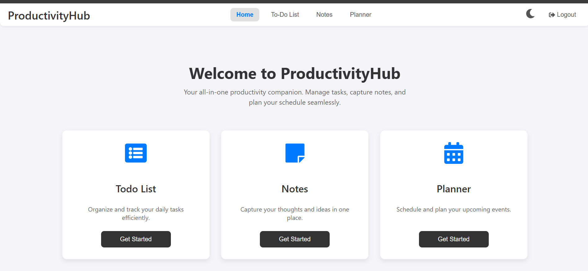
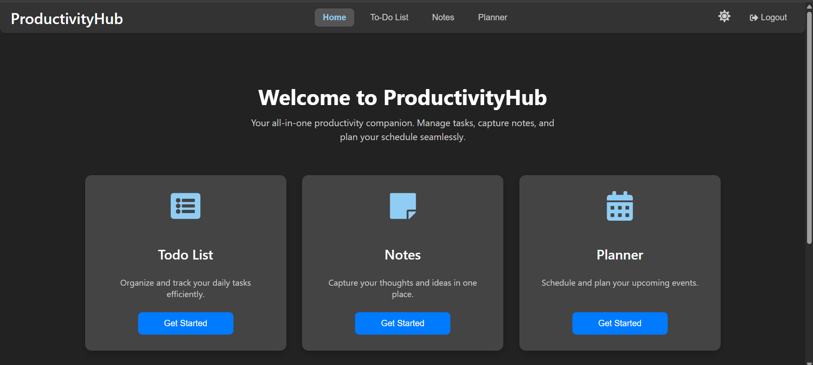
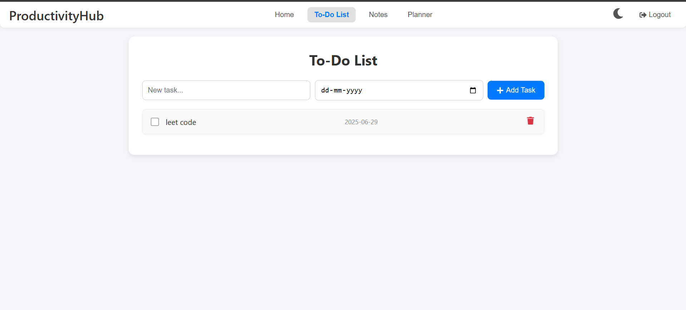
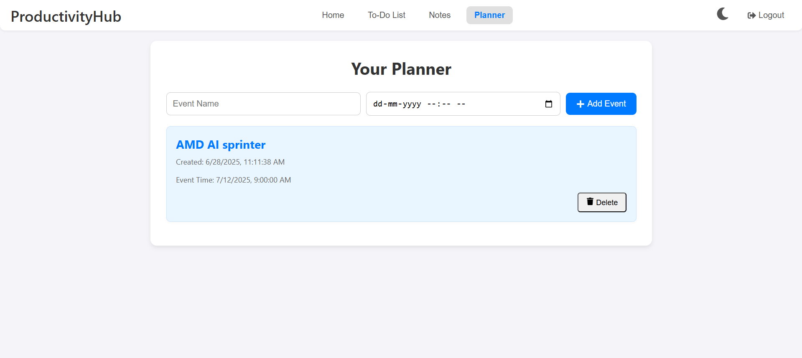
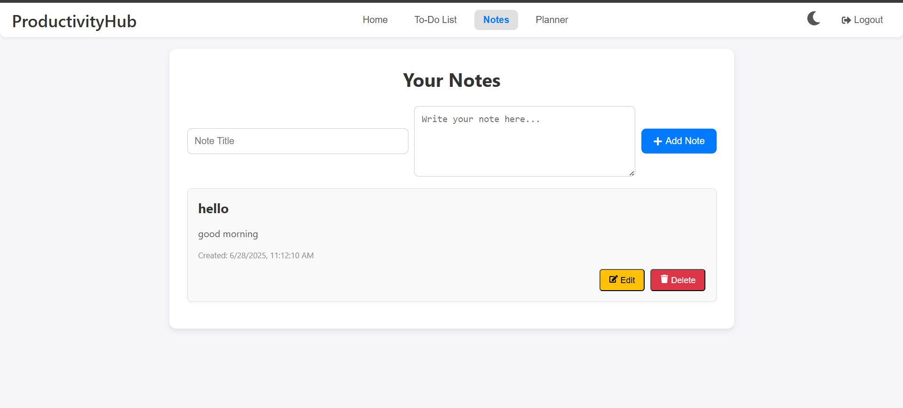

# 🧠 ProductivityHub

**ProductivityHub** is your all-in-one productivity companion. This full-stack web application helps users manage their **to-do lists**, take **notes**, and plan their **upcoming events**, all in one clean and organized dashboard.

🌐 **Live App**: [to-do-list176.netlify.app](https://to-do-list176.netlify.app/)

---

## 📌 Features

- ✅ **To-Do List**: Add, mark, and delete daily tasks with due dates
- 📝 **Notes**: Save, edit, and delete personal notes
- 📅 **Planner**: Schedule upcoming events with time and date
- 🔐 **Authentication**: Secure login/logout (if implemented)
- 🌗 **Dark Mode**: Toggle between light and dark
- 📱 **Responsive Design**: Fully responsive for all screen sizes

---

## ⚙️ Tech Stack

- **Frontend**: React, Tailwind CSS
- **State Management**: React Hooks (`useState`, `useEffect`)
- **Routing**: React Router
- **Deployment**: Netlify

---

## 📸 Screenshots

###  Home Page



### To-do-list


### Planner


### Notes


---

## 🧰 Installation Guide

To run this project locally:

```bash
git clone https://github.com/ayussh176/To-do-list.git
cd To-do-list
npm install
npm start
